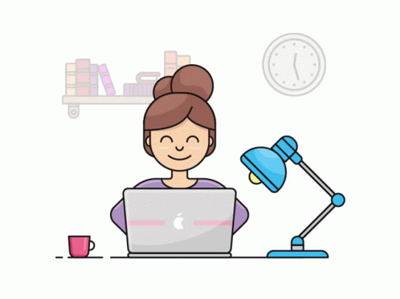

 
<h1 align="center">Hi 👋, I'm Ashley Scott</h1>
<h3 align="center">Designer & Web Developer</h3>

  

  

  

- 🔭 I’m currently working on **Café Menu**

- 🌱 I’m currently learning **HTML, CSS, & JavaScript**

- 💬 Ask me about **Design plus development**

- 📫 How to reach me **iamashleymscott@gmail.com**

- ⚡ Fun fact **while coding I like to eat m&ms**

<h3 align="left">Connect with me:</h3>

<h3 align="left">Languages and Tools:</h3>

      

<h3 align="left">Support:</h3>

  

&nbsp;

